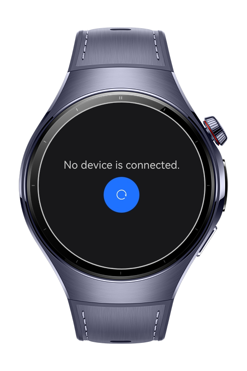
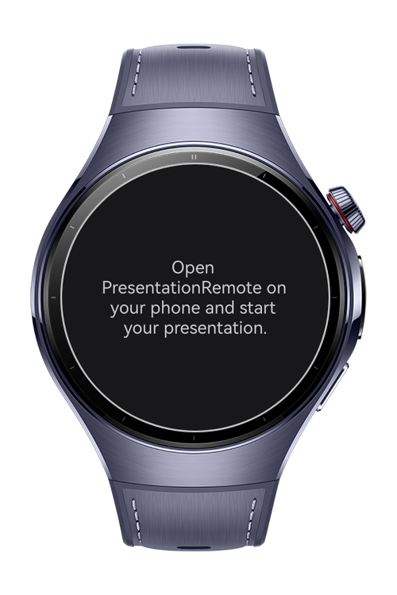

> **Note:** To access all shared projects, get information about environment setup, and view other guides, please visit [Explore-In-HMOS-Wearable Index](https://github.com/Explore-In-HMOS-Wearable/hmos-index).

# PresentationRemote

This app demonstrates how to control a presentation app using wear engine.

# Preview

<div>
  
  
  
  
</div>

# Use Cases

- Use wear engine to control your presentation.
- Go previous and next slides.
- Close presentation.

# Tech Stack

- **Languages**: ArkTS, ArkUI
- **Frameworks**: HarmonyOS SDK 5.1.0(18)
- **Tools**: DevEco Studio Version 5.1.1.830
- **Libraries**:
    - `@kit.ArkTS`
    - `@kit.WearEngine`

# Directory Structure

```
entry/src/main/ets/
├───components
│       Splash.ets
├───entryability
│       EntryAbility.ets
├───entrybackupability
│       EntryBackupAbility.ets
├───model
│       Presentation.ets
├───pages
│       Index.ets
└───util
        Engine.ets
```

# Constraints and Restrictions

## Supported Device

* Huawei Watch 5

# License

**PresentationRemote** is distributed under the terms of the MIT License
See the [LICENSE](./LICENSE) for more information.